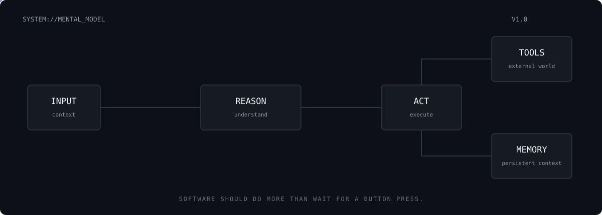
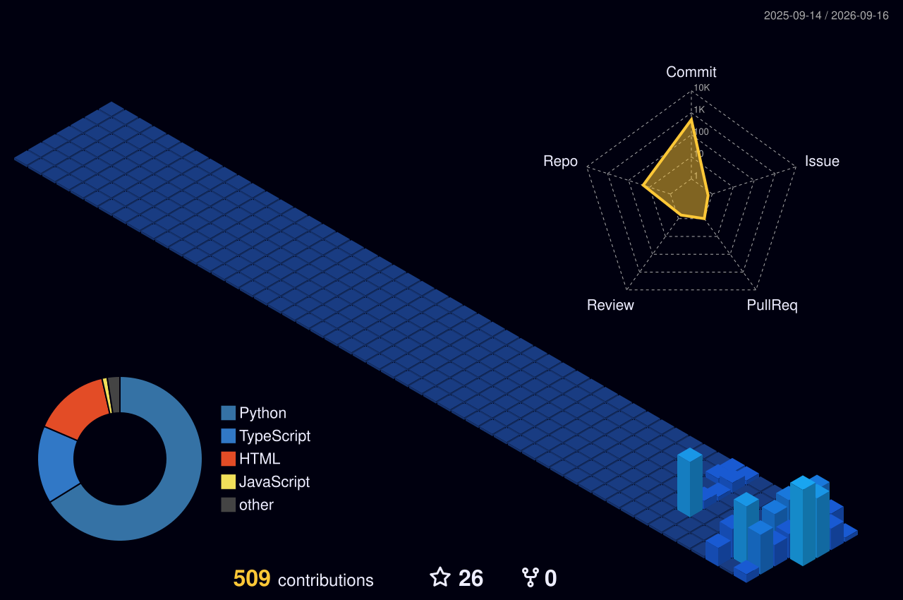

  

 

<table>
<tr>
<td width="61%" valign="middle">

<h1>I build software that observes, reasons, creates, and acts.</h1>

AI systems, creative tooling, developer infrastructure,
and experiments around what software can become when
intelligence is treated as a primitive — not a feature.

 

<code>~/arjun → currently shipping</code>

  

<a href="arjun-chandra-portfolio.vercel.app">PORTFOLIO</a>
&nbsp;&nbsp;·&nbsp;&nbsp;
<a href="linkedin.com/in/arjun-chandra-0b0b5826a/">LINKEDIN</a>
&nbsp;&nbsp;·&nbsp;&nbsp;
<a href="mailto:aarjunchandra@gmail.com">EMAIL</a>

</td>

<td width="39%" align="center" valign="middle">

</td>
</tr>
</table>

 

---

 

## `01 / CURRENTLY BUILDING`

### VIRALYST

**Content intelligence for short-form media.**

A system designed to move beyond surface-level analytics:
understand what works, understand *why* it works, and turn
that intelligence into better creative decisions.

`Research → Intelligence → Creation → Editing`

 

### JARVIS

**A personal execution layer for AI.**

Connecting models, tools, workflows, permissions and
verification so AI can move from answering questions
to actually completing work.

`Intent → Planning → Tools → Execution → Verification`

 

### VIDEO EDITOR

**A programmable editing environment built for AI-native workflows.**

Turning editing operations into tools that software can
understand, invoke and verify — without replacing the
creative judgment of the editor.

`Timeline → Tools → Automation → Human Taste`

 

---

 

## `02 / WHAT I CARE ABOUT`

> I like products that feel obvious only after somebody builds them.

**Systems over wrappers.**  
**Taste over feature count.**  
**Shipping over endless prototypes.**

I'm especially interested in the point where AI stops being
a chatbot sitting beside software and starts becoming part
of the software itself.

 

  

 

---

 

## `03 / TOOLS I REACH FOR`

<table>
<tr>
<td><b>LANGUAGES</b></td>
<td>Python · TypeScript · JavaScript</td>
</tr>

<tr>
<td><b>INTERFACE</b></td>
<td>React · Next.js · Tailwind</td>
</tr>

<tr>
<td><b>SYSTEMS</b></td>
<td>Node.js · FastAPI · Docker</td>
</tr>

<tr>
<td><b>AI / VISION</b></td>
<td>LLMs · RAG · OpenCV · Agents</td>
</tr>

<tr>
<td><b>ENVIRONMENT</b></td>
<td>Linux · Git · GitHub · VS Code</td>
</tr>
</table>

 

---

 

## `04 / PROOF OF WORK`

  

 

---

 

## `05 / ACTIVITY`

 

---

 

<a href="YOUR_PORTFOLIO_URL">Portfolio</a>
&nbsp;&nbsp;&nbsp;·&nbsp;&nbsp;&nbsp;
<a href="YOUR_LINKEDIN_URL">LinkedIn</a>
&nbsp;&nbsp;&nbsp;·&nbsp;&nbsp;&nbsp;
<a href="https://github.com/Arjun-Chandra-7">GitHub</a>

  

<code>~/arjun</code>

  

<b>Still building things I don't know how to build yet.</b>

